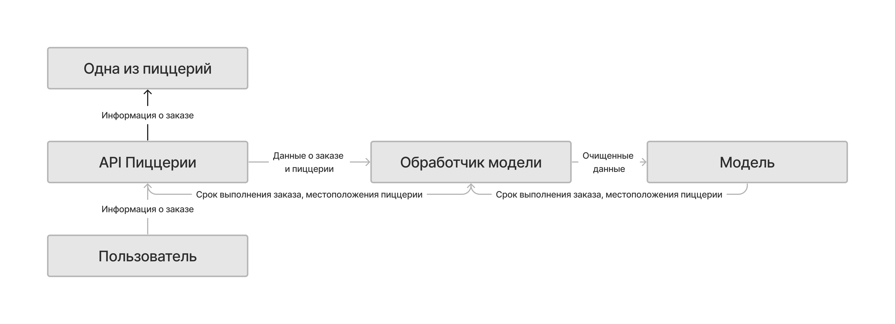

## Дизайн ML системы - сервис оптимизации заказов в сети пиццерий

Идея состоит в том, чтобы оптимизировать доставку заказов среди сети пиццерий, чтобы в случае высокой нагрузки на один из ресторанов, клиент не ждал долгое время или заказ вовсе не был отклонён. В перспективе это увеличит эффективность производства пиццы в ресторане. Эту задачу можно решить с помощью машинного обучения.

### 1. Цели и предпосылки 
#### 1.1. Зачем идем в разработку продукта?  

- **Цель бизнеса:** Увеличить эффективность производства пиццы в сети ресторанов, сократив время приготовления и улучшив качество продукции.
- **Почему станет лучше, чем сейчас, от использования ML?** \
Человек чисто физически не способен распределять нагрузку на несколько ресторанов, особенно, если их количество достаточно большое, а обычные системы распределения могут не учитывать множественные факторы.
- **Что будем считать успехом итерации с точки зрения бизнеса?** \
Успехом с точки зрения бизнеса будем считать уменьшение нагрузки на рестораны (очереди заказов), соответственно сокращение времени приготовления пиццы для конечного потребителя.

#### 1.2. Бизнес-требования и ограничения  

**Логика работы ML системы:** Машинное обучение будет решать задачу оптимизации стратегии распределения заказов с использованием обучения с подкреплением.

**Краткое описание БТ:**
1. *Сокращение времени ожидания клиентов:* Клиенты ожидают, что их заказы будут выполнены быстро и доставлены вовремя. Система должна оптимизировать процесс приготовления пиццы и доставки, чтобы сократить время ожидания клиентов.
2. *Удовлетворение спроса клиентов:* Система должна предсказывать, какие заказы будут популярными или востребованными, чтобы оптимизировать процесс приготовления пиццы и доставки, чтобы удовлетворить спрос клиентов.
3. *Минимизация времени доставки:* Система должна оптимизировать распределение заказов между пиццериями, чтобы минимизировать время доставки и улучшить обслуживание клиентов.
4. *Сокращение затрат на доставку:* Система должна оптимизировать процесс доставки, чтобы сократить затраты на доставку и улучшить прибыльность бизнеса.
5. *Улучшение обслуживания клиентов:* Система должна предоставлять клиентам информацию о времени выполнения заказа и статусе доставки, чтобы улучшить их опыт и удовлетворенность.
6. *Автоматизация процесса:* Система должна быть автоматизированной, чтобы минимизировать участие человека в процессе распределения заказов и доставки, что позволит сократить ошибки и улучшить эффективность работы.
7. *Адаптация к изменениям:* Система должна быть гибкой и способной адаптироваться к изменениям в спросе, доступности пиццерий и других факторах, чтобы обеспечить оптимальное распределение заказов и доставку в любых условиях.

**Бизнес-ограничения:**
1. *Ограничения по времени:* Система должна быть способна обрабатывать заказы и распределять их между пиццериями в наикратчайшие сроки, чтобы не тормозить работу сети.
2. *Ограничения по местоположению:* Система должна учитывать местоположение пиццерий и клиентов, чтобы оптимизировать распределение заказов и доставку. Стоит учитывать, выгоднее ли передавать клиента в более далекие пиццерии, чем заставить его подождать в ближайшей.

**Что мы ожидаем от конкретной итерации** \
От конкретной итерации мы ожидаем, что модель будет улучшаться и становиться более точной в предсказании времени выполнения заказа и выборе оптимальной стратегии распределения заказов между пиццериями.\
В каждой итерации модель будет получать новые данные о заказах и обратную связь о том, были ли ее решения оптимальными или нет. На основе этих данных модель будет учиться и улучшать свою способность принимать оптимальные решения.\
С каждой итерацией модель будет становиться все более точной и эффективной в предсказании времени выполнения заказа и выборе оптимальной стратегии распределения заказов. Это позволит оптимизировать процесс доставки и улучшить обслуживание клиентов. Отсюда следует, что эффективность модели будет зависеть от качества данных, на которых она обучается. Поэтому **важно** обеспечить доступ к качественным и репрезентативным данным за довольно длительный период для обучения модели.

**Среда разработки:** разработка на мощностях компании в её удалённом сервере. Отдельная виртуальная машина, находящаяся в локальной среде в кластере.

**Описание бизнес-процесса пилота, насколько это возможно - как именно мы будем использовать модель в существующем бизнес-процессе?**   
Предположительные этапы ввода в эксплуатацию и использования модели \
1. *Сбор данных:* Мы будем собирать данные о заказах, включая время заказа, состав заказа и местоположение клиента, а также пиццерий, из которых они будут доставлены.
2. *Обучение модели:* Мы будем использовать собранные данные для обучения модели. Модель будет обучаться на основе входных данных, чтобы предсказывать время выполнения заказа и выбирать оптимальную стратегию распределения заказов.
3. *Тестирование модели:* После обучения модели мы будем тестировать её на новых данных, чтобы оценить ее точность и эффективность.
4. *Внедрение модели в бизнес-процесс:* Если модель показывает хорошие результаты в тестировании, мы будем внедрять ее в существующий бизнес-процесс. Модель будет использоваться для предсказания времени выполнения заказа и выбора оптимальной стратегии распределения заказов между пиццериями изначально в тестовом режиме параллельно со старой моделью работы сети.
5. *Оценка результатов:* Мы будем отслеживать и анализировать результаты использования модели в бизнес-процессе. Мы будем измерять время ожидания клиентов, удовлетворенность клиентов, эффективность доставки и другие метрики, чтобы оценить эффективность модели и ее влияние на бизнес.
6. *Оптимизация модели:* Если результаты использования модели не удовлетворительны, мы будем проводить дополнительные исследования и оптимизацию модели. Мы можем изменять входные данные, параметры модели или алгоритмы обучения, чтобы улучшить ее эффективность.
7. *Полноценное внедрение модели в работу сети:* Как только мы удостоверимся в стабильности работы модели, она будет полноценно внедрена в сеть. Начиная с этого этапа, модель не доложна подвергаться серьёзным корректировкам. 

#### 1.3. Что входит в скоуп проекта/итерации, что не входит   

Бета-версия модели.

**На закрытие каких БТ подписываемся в данной итерации:**
- Сокращение времени ожидания клиентов.
- Удовлетворение спроса клиентов.
- Минимизация времени доставки.
- Сокращение затрат на доставку.
- Улучшение обслуживания клиентов.
- Автоматизация процесса.
- Адаптация к изменениям. 

**Что не будет закрыто:**
Вероятно, в первой итерации может быть не закрыто ограничение по времени ожидания клиентов. Но, с каждой последующей итерацией, оно будет уменьшаться и вскоре начнёт удовлетворять спрос клиентов.

**Описание планируемого технического долга (что оставляем для дальнейшей продуктивизации)**
В связи с предыдущим пунктои, очевидно, скорость работы останется техническим долгом на первую итерацию.

#### 1.4. Предпосылки решения  

* **Блоки данных:** Мы будем использовать блоки данных, содержащие информацию о заказах, включая время заказа, состав заказа и местоположение клиента. Эти данные будут использоваться для обучения модели.
* **Горизонт прогноза:** Мы будем использовать горизонт прогноза, который определяет, на какое время вперед модель будет предсказывать время выполнения заказа. Например, мы можем использовать горизонт прогноза в 30 минут, чтобы предсказать время выполнения заказа в течение ближайших 30 минут.
* **Гранулярность модели:** Мы будем использовать гранулярность модели, которая определяет, с какой точностью модель будет предсказывать время выполнения заказа. Например, мы можем использовать гранулярность в 5 минут, чтобы предсказывать время выполнения заказа с точностью до 5 минут.
* **Ограничения по времени:** Мы будем учитывать ограничения по времени, чтобы модель могла обрабатывать заказы вовремя и удовлетворять ожидания клиентов.
* **Ограничения по ресурсам:** Мы будем учитывать ограничения по ресурсам, чтобы модель могла использовать все доступные ресурсы на сервере или в кластере с максимальной производительностью.
* **Ограничения по местоположению:** Мы будем учитывать ограничения по местоположению, чтобы модель могла оптимизировать распределение заказов между пиццериями и минимизировать время доставки.
* **Ограничения по бюджету:** Мы будем учитывать ограничения по бюджету, чтобы модель могла оптимизировать процесс доставки и улучшить прибыльность бизнеса.

***Имеются уже готовые решения для данных задач:***
* *Delivery Management System (DMS): Delivery Management System:* это система управления доставкой, которая использует алгоритмы машинного обучения для оптимизации процесса доставки. DMS может предсказывать время выполнения заказа и выбирать оптимальную стратегию распределения заказов между пиццериями.
* *Route Optimization Software: Route Optimization Software:* это программное обеспечение, которое использует алгоритмы оптимизации для выбора оптимального маршрута доставки. Оно может учитывать множество факторов, таких как время выполнения заказа, доступность пиццерий и расстояние до клиента, чтобы выбрать оптимальный маршрут.
* *Delivery Logistics Platforms: Delivery Logistics Platforms:* это платформы, которые предоставляют услуги по оптимизации доставки. Они могут использовать алгоритмы машинного обучения для предсказания времени выполнения заказа и выбора оптимальной стратегии распределения заказов между пиццериями.
* *Cloud-based Delivery Management Solutions:* это облачные решения, которые предоставляют услуги по оптимизации доставки. Они могут использовать алгоритмы машинного обучения для предсказания времени выполнения заказа и выбора оптимальной стратегии распределения заказов между пиццериями.

### 2. Методология

#### 2.1. Постановка задачи  

Необходимо решить следующие задачи:
* Предсказание времени выполнения заказа: Мы используем регрессионные модели для предсказания времени выполнения заказа на основе входных данных о составе заказа.
* Предсказание популярности заказов: Мы используем классификационные модели для предсказания, какие заказы будут популярными или востребованными на основе входных данных о составе заказа.
* Оптимизация распределения заказов: Мы используем оптимизационные модели для нахождения оптимального распределения заказов между пиццериями.
* Предсказание времени выполнения заказа с использованием глубокого обучения: Мы используем модели глубокого обучения для предсказания времени выполнения заказа на основе входных данных о составе заказа.
* Оптимизация стратегии распределения заказов с использованием обучения с подкреплением: Мы используем модели обучения с подкреплением для нахождения оптимальной стратегии распределения заказов между пиццериями.

#### 2.2. Блок-схема решения  

**Блок-схема решения:**  

#### 2.3. Этапы решения задачи

***Этап 1 - Подготовка данных***

В этом этапе должно быть следующее:  

**Данные и сущности, на которых будет обучаться ваша модель машинного обучения.**

* *Идентификатор заказа:* уникальный идентификатор, который позволяет идентифицировать каждый заказ. Тип данных - целое число.
* *Время заказа:* время, когда был сделан заказ. Тип данных - время.
* *Состав заказа:* информация о том, какие продукты или блюда были заказаны. Тип данных - строка.
* *Местоположение клиента:* адрес или местоположение клиента, откуда был сделан заказ. Тип данных - строка.
* *Идентификатор пиццерии:* уникальный идентификатор, который позволяет идентифицировать каждую пиццерию.
* *Местоположение пиццерии:* адрес или местоположение пиццерии.
* *Время приготовления пиццы:* среднее время, необходимое для приготовления пиццы в данной пиццерии.
* *Количество доступных пиццерий:* количество пиццерий, доступных для выполнения заказа.
* *Расстояние до клиента:* расстояние от пиццерии до местоположения клиента.

| Название данных  | Есть ли данные в компании (если да, название источника/витрин) | Требуемый ресурс для получения данных (какие роли нужны) | Проверено ли качество данных (да, нет) |
| :-- | :-- | :-- | :-- |
| Идентификатор заказа | Да, из БД/CRM с информацией о заказах | DE | Да |
| Идентификатор пиццерии, собравшей заказ | Да, из БД/CRM с информацией о пиццериях | DE | Да |
| Время заказа | Да, из БД/CRM с информацией о заказах | DE | Да |
| Состав заказа | Да, из БД/CRM с информацией о заказах | DE | Да |
| Местоположение клиента | Да, из БД/CRM с информацией о заказах | DE | Да |
| Местоположение пиццерии | Да, из БД/CRM с информацией о заказах | DE | Да |
| Время приготовления пиццы | Да, предоставит заказчик | DE | Да |
| Количество доступных пиццерий | Да, из БД/CRM с информацией о пиццериях | DE | Да |
| Расстояние до клиента | Да, в обезличенном виде предоставит заказчик | DE | Да |

 
На выходе этапа сбора данных о заказах мы должны получить витрину данных.
Эти витрины данных будут использоваться для обучения модели машинного обучения, чтобы предсказывать время выполнения заказа и выбирать оптимальную стратегию распределения заказов между пиццериями.

**Риски:**
* *Недостаток данных:* Если данных для обучения модели недостаточно, это может привести к неточным предсказаниям и неправильным решениям. Чтобы минимизировать этот риск, можно использовать методы, такие как увеличение объема данных, использование синонимичных данных или синтетических данных, а также использование предварительной обработки данных. В теории произойти не должно, поскольку у зачказчика должна быть база, хранящая историю заказов.

***Этап 2 - Построить прогнозные модели***
 
**Предварительно разделим датасет на 3 выборки:**
- Обучение: Для обучения модели мы будем использовать выборку данных, которая содержит информацию о заказах, включая время заказа, состав заказа и местоположение клиента. Эта выборка данных будет репрезентативной и отражать различные сценарии и условия, с которыми модель может столкнуться в реальном мире. Мы будем стремиться к тому, чтобы выборка данных была достаточно большой и разнообразной, чтобы модель могла обучаться на различных примерах и принимать оптимальные решения.
- Тестирование: Для тестирования модели мы будем использовать другую выборку данных, которая не будет использоваться для обучения модели. Эта выборка данных также будет репрезентативной и отражать различные сценарии и условия, с которыми модель может столкнуться в реальном мире. Мы будем использовать эту выборку данных для оценки точности и эффективности модели, чтобы убедиться, что она способна принимать оптимальные решения на основе новых данных.
- Валидация: Для валидации модели мы будем использовать третью выборку данных, которая также не будет использоваться для обучения модели. Эта выборка данных будет репрезентативной и отражать различные сценарии и условия, с которыми модель может столкнуться в реальном мире. Мы будем использовать эту выборку данных для оценки качества модели и ее способности принимать оптимальные решения на основе новых данных.

**Посчитаем параметры прогноза:**
- Горизонт прогноза: может быть установлена от 30 секунд до 1 минуты в зависимости от предоставленных заказчиком мощностей.
- Гранулярность модели: Гранулярность модели может быть установлена на 5 минут. Такой точности вполне достаточной для использования модели в реальном мире.
- Частота пересчета прогнозных моделей: Частота пересчета прогнозных моделей может быть установлена на 15 минут, либо во время поступления нового заказа.

**Определение целевой переменной, согласованное с бизнесом:**
Целевая переменная в данном случае - это время выполнения заказа. 

**Какие метрики качества используем и почему они связаны с бизнес-результатом:**
* *Точность предсказания времени выполнения заказа:* может быть измерена с помощью метрики среднеквадратической ошибки (MSE) или среднеквадратической относительной ошибки (RMSE).
* *Эффективность распределения заказов:* Эффективность распределения заказов может быть измерена с помощью метрики средней задержки доставки (MDD) или средней задержки доставки в процентах (MDD%).

**Риски:**
* *Технический долг:* Если модель не обновляется или не оптимизируется, это может привести к неправильным решениям и негативным последствиям для бизнеса. Чтобы минимизировать этот риск, можно проводить регулярное обновление модели, оптимизацию кода и использование новых методов и алгоритмов.
  
- Верхнеуровневые принципы и обоснования для: feature engineering, подбора алгоритма решения, техники кросс-валидации, интерпретации результата (если применимо).
**Верхнеуровневые принципы и обоснования:**
* Feature engineering - наш датасет чистый и правильный изначально, потому что это рабочие данные.
* Подбор алгоритма решения - в нашем случае с пиццерией, можно использовать алгоритмы, такие как регрессия, классификация или оптимизация, чтобы предсказывать время выполнения заказа и выбирать оптимальную стратегию распределения заказов.
* Техника кросс-валидации - как описывалось выше, будем использовать три выборки из датасета - обучающую, валидационную и тестовую для достиижения наибольшей точности модели. 
* Интерпретация результата - можно использовать метрики, обозначенные ранее для определения ошибок в поведении модели. 

***Этап 3 - Тестирование моделей.***

Для изначального определения точности модели будем тестировать при помощи валидационных выборок, ближе к проду будем тестировать на реальных заказах без ввода в эксплуатацию.

**Ввод в эксплуатацию:**
- Запуск модели
- Запуск бета-тестирования

***Этап 4 - Подготовка пилота и закрытие технического долга.***

Внедрение модели в имеющийся бэкенд путём добавления нового метода в API, передающего в нейросеть очередной заказ и отдающего на выходе перераспределённые заказы в очереди с последующей рассылкой и обновлением результатов в пиццериях.

**Закрытие технического долга будет производиться по мере завершения бета-тестирования путём:**
* Анализа результатов
* Оптимизации модели
* Последующим тестированием и переоценкой
* Фидбек от пользователей - введение рейтинговой системы с оценкой удобства и точности.

***Результатом выполнения всех этапов будет бета-тест готовой модели и последующий вывод её в прод.***
  
### 3. Подготовка пилота  
  
#### 3.1. Способ оценки пилота  
  
* *Анализ результатов:* Мы будем анализировать результаты работы модели, чтобы понять, какие факторы влияют на ее предсказания и какие стратегии распределения заказов являются наиболее эффективными.
* *Оценка точности и эффективности:* Мы будем оценивать точность и эффективность модели, используя метрики, такие как точность предсказания времени выполнения заказа и эффективность распределения заказов.
* *Фидбек от пользователей:* Мы будем получать обратную связь от пользователей, чтобы понять, насколько они удовлетворены работой модели и какие улучшения можно внести.
* *Оценка бизнес-результатов:* Мы будем оценивать бизнес-результаты, чтобы понять, насколько модель соответствует бизнес-требованиям и обеспечивает оптимальное распределение заказов и доставку в любых условиях.
  
#### 3.2. Что считаем успешным пилотом  
  
- Скорость работы нейросети в районе 30 секунд на 1 запрос.
- Эффективная работы нейросети, нагрузка распределяется равномерно.
- Положительный фидбек от пользователей.
  
#### 3.3. Подготовка пилота  
  
Имеется большая привязка к количеству данных, поэтому нельзя точно оценить затраты на обучение. Т.к. задача довольно многопрофильная, скорее всего, придётся разработать собственную модель в PyTorch или TensorFlow.
  
#### 4.1. Архитектура решения   
  

  
#### 4.2. Описание инфраструктуры и масштабируемости 
  
**Выбрана простая архитектура, которая может быть расширена в будущем.**
- Простота взаимодействия с API позволяет просто взаимодействовать с нейросетью.
- Гарантия отказоустойчивости в случае высокой нагрузки может быть достигнута кластеризацией обработчика на один или несколько серверов.
  
#### 4.3. Требования к работе системы  
  
SLA будет зависеть от размера текущего заказа, т.к. напрямую кореллирует со временем от поступления заказа и до дверей заказчика. Например, если текущий заказ большой, то SLA может быть высоким. Если текущий заказ маленький, то SLA может быть низким. Мы не можем явно вычислить данную метрику.
  
#### 4.4. Безопасность системы  
  
Модель никак не будет на прямую взаимодействовать с пользователем, это значит, что вся ответственность за чистоту данных, переданных в нейросеть, будет лежать на бэкенде.
  
#### 4.5. Безопасность данных   
  
В обучении не будут использоваться какие-либо персональные данные, так что фактически никакие из законов нарушенными не будут
  
#### 4.6. Издержки  
  
Затраты будут прямо зависеть от количества заказов и пиццерий.
  
#### 4.5. Integration points  
  
Необходим единственный метод в API, передающий в нейросеть очередной заказ и отдающий на выходе перераспределённые заказы в очереди с последующей рассылкой и обновлением результатов в пиццериях.
  
#### 4.6. Риски  
  
Необходимо найти баланс между точностью и временем выполнения, поскольку вычислительные мощности не безграничны. В остальном мы будем иметь в виду некоторые ограничения, перечисленные ранее.